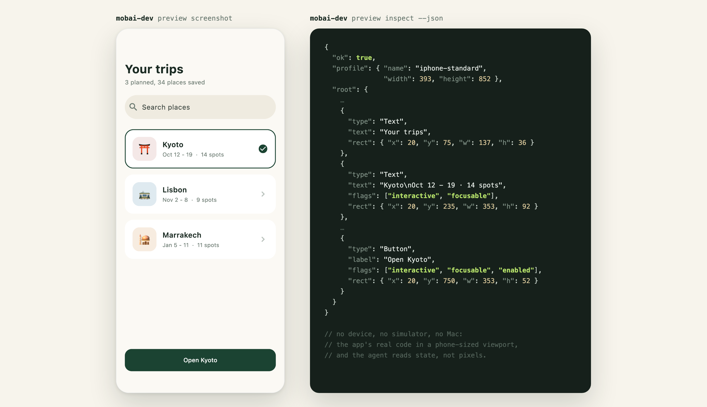

# mobai-dev

Everything a coding agent needs to build iOS apps from a Linux sandbox.
`mobai-dev` is one binary that previews the app, builds it, runs it on
simulators, and drives a real phone, from the environments where cloud
agents live.

It talks to your MobAI account with an API key, and the key comes from the
[MobAI](https://mobai.run) desktop app, so install the app first.



## What an agent can do

### 1. Preview SwiftUI, React Native and Flutter (free)

The preview runs the app's real code in a phone-sized viewport on plain
Linux: no device, no simulator, no Mac. The agent reads the screen as a
semantic tree, taps and types by label, screenshots, and hot reloads after
edits. Location, permissions, the camera, the network and the signed-in user
are all mockable, so unhappy paths are one line away. Packages that need real
hardware are repaired with small adapters; a catalogue of ready-made ones
lives in [adapters/](adapters/INDEX.md). The whole workflow is taught to the
agent by the previewing-mobile-apps skill, which `mobai-dev setup` installs
from inside the binary, so it always matches the CLI version.

### 2. Build apps on GitHub Actions (free)

A sandbox has no Xcode, so iOS builds run on a GitHub Actions macOS runner in
your own repo, driven by the embedded
[ios-builder](https://github.com/MobAI-App/ios-builder) engine. The first
`mobai-dev build --ios` writes the workflow file and asks for one commit;
after that it dispatches the build and hands the agent the artifact. Signed
builds need one extra one-time step on your machine, `builder signing setup`,
which puts your certificate in the repo's secrets. Android builds run right
in the sandbox when the Android toolchain is present.

### 3. Give the agent a simulator (Pro)

`mobai-dev sim start` builds the project and attaches an iOS simulator
running it to your account, on a GitHub Actions macOS runner. The agent
drives it like any MobAI device, and you can watch and take over from the
MobAI app.

### 4. Drive your physical phone (free allowance, then Pro)

With the one-time phone setup done, the agent reaches your iPhone from the
sandbox over your tailnet: it can install the app it just built, launch it,
tap, type, scroll, screenshot, and run UI tests, almost as if the phone were
plugged into the sandbox over USB. A metered free allowance is included;
sustained use needs Pro.

## Set up your sandbox

<details>
<summary><b>Claude Code</b></summary>

In the repo settings, set the environment setup command to:

```bash
curl -fsSL https://mobai.run/cloud/claude-code.sh | sh
```

Claude Code's environment variables are visible to everyone in the environment
and are not available while the setup command runs, so nothing secret goes
there. The script only installs tools; you connect inside the chat instead,
by approving a Tailscale login link and an emailed code. The one variable
worth setting is plain and not a secret:

```
MOBAI_ACCOUNT_EMAIL=<your mobai account email>
```

The sandbox filters outbound traffic. The simplest option is to allow full
internet access for the environment; if you prefer an allowlist, these are
the hosts we know about (your project's own tooling may need more):

```
mobai.run
*.mobai.run
tailscale.com
*.tailscale.com
controlplane.tailscale.com
pkgs.tailscale.com
github.com
*.githubusercontent.com
registry.npmjs.org
deviceboxhq.com
gs.apple.com
pdomnyovfhqsjhgtixub.supabase.co
```

</details>

<details>
<summary><b>Cursor</b></summary>

In `.cursor/environment.json`, set the install command to:

```bash
curl -fsSL https://mobai.run/cloud/cursor.sh | sh
```

Put these in the environment's secrets:

```
MOBAI_API_KEY=<your mobai API key>
MOBAI_TAILSCALE_KEY=<tailscale ephemeral auth key>
MOBAI_ACCOUNT_EMAIL=<your mobai account email>
```

Cursor allows all traffic by default, which is the simplest thing to keep.
If you turned filtering on, allow the hosts listed in the Claude Code
section, and expect that list to grow: your project's own tooling may need
more.

</details>

<details>
<summary><b>Codex</b></summary>

In the environment settings, set the setup script to:

```bash
curl -fsSL https://mobai.run/cloud/codex.sh | sh
```

and put `MOBAI_API_KEY=<your mobai API key>` in the environment's secrets.

Codex filters outbound traffic as well: the simplest option is full internet
access, otherwise allow the hosts from the Claude Code section minus the
Tailscale ones, and expect the list to be incomplete for your project's own
tooling.

Codex's sandbox blocks the connection a tailnet join needs, so this script
skips Tailscale. Previews, builds and simulators all work; driving a physical
phone does not, yet. Use Claude Code or Cursor when the phone is the point.

</details>

<details>
<summary><b>Grok bot</b></summary>

Coming soon. We have not verified Grok's sandbox yet.

</details>

## First session

Just ask the agent. The sandbox setup already taught it what mobai-dev is, so
open a session in your project and say something like:

> Set up the mobai preview for this project and show me the main screen.

The agent runs setup, installs the engine, starts the preview and comes back
with a screenshot. From there you ask for things across the whole toolchain:
show the paywall in dark mode, build the app, run it on a simulator, install
it on my phone and tap through onboarding there.

## Reaching your phone from a sandbox

Driving a physical device goes over your own tailnet, and the phone side is a
one-time setup: connect the iPhone to the MobAI app and run its remote device
wizard, which pairs the phone and puts it on the tailnet. Details are in the
[cloud agents docs](https://mobai.run/docs/cloud-agents/).

## Signing

Optional. With signing configured, a session can sign the apps it builds and
keep your device ready on its own. The remote device wizard shows the exact
steps: a wildcard provisioning profile and an exported certificate,
base64-encoded into two environment secrets. A phone set up with a free Apple
ID needs reconnecting weekly; a paid Apple Developer account lasts a year.

## Publishing

Shipping to TestFlight and the App Store from the sandbox: coming soon.

## Issues

This is the tracker for the CLI and all the preview engines. Paste the JSON
diagnostic the tool printed; it is designed to carry everything a report
needs.

## Licensing

The source in this repository is MIT, in [LICENSE](LICENSE). The CLI binaries
and engine archives ship on this repository's
[Releases page](https://github.com/MobAI-App/mobai-dev/releases), are free to
download and run, and are covered by [LICENSE-BINARY.md](LICENSE-BINARY.md),
which also travels with every release as an asset.
